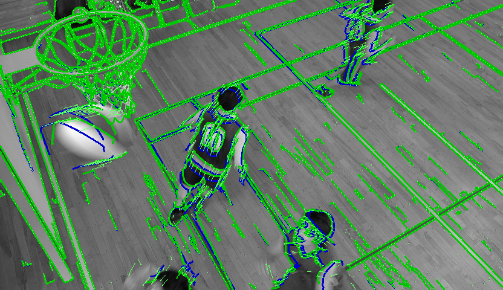

# Edge-Tracking
Tracking the edges  between 2 frames

## Table of Contents

- [Installation](#installation)
- [Usage](#usage)
- [Contributing](#contributing)
- [Documentation](#Documentation)

## Installation

1. Clone the repository.
2. Install dependencies:
You can install the package using pip:

```bash
pip install opencv-python
pip install numpy
pip install tqdm
pip install scipy
```

## Usage:
```bash
python edge_tracking.py
```
- Run edge_tracking.py file to get the result:


The difference in position between the blue edges from the previous frame and the
green edges predicted for the current frame signifies the manifestation of optical
flow or, in other words, "edge flow" within this algorithm. The green arrows represent motion vectors generated by the Lucas-Kanade optical flow algorithm, depicting the velocities of key points tracked through the motion analysis process. In other words, these arrows illustrate the speed of the key points as determined by the Lucas-Kanade optical flow method.

## Documentation
This code primarily utilizes the KLT (Kanade-Lucas-Tomasi) keypoint tracking and affine transformation methods for tracking edges in two consecutive frames of images.
for a more in-depth exploration of edge tracking algorithms, you can refer to my master's thesis.
Check out the [PDF documentation](Master_Thesis.pdf) for more detailed information.

